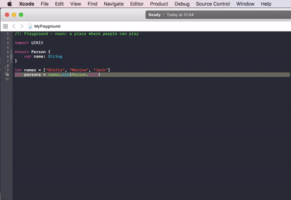
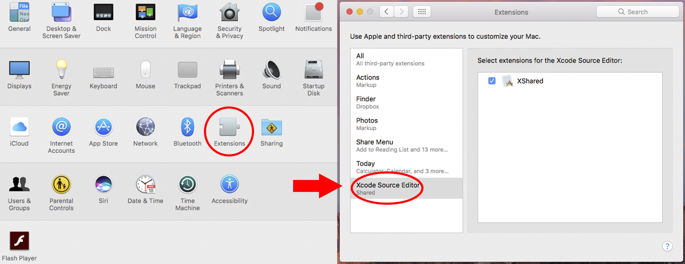

  

### This extension is for those who like to show code to the public :sunglasses:

Xcode extension which allows you copying the code with special formatting quotes for social (Slack, Telegram).

## Install :fire:

### Manual:
1. Check that Xcode version greater or equal than 8.0.
2. If you are using OS X 10.11, running `sudo /usr/libexec/xpccachectl` and rebooting are required for using Xcode Extension.
3. Clone this repository.
4. Open `Shared.xcodeproj` via Xcode.
5. Configure signing with your own developer ID. 
6. Quit Xcode.
7. Open a terminal, change to the directory where you cloned and run `xcodebuild -scheme XShared install DSTROOT=~` to compile the extension.

### Or download the latest release: [xshared](https://github.com/Otbivnoe/XShared/releases/tag/1.0.0)

8. Run `~/Applications/Shared.app` and quit.
9. Go to ***System Preferences -> Extensions -> Xcode Source Editor*** and enable the extension.

10. Done.

## Author :muscle:

[Nikita Ermolenko](https://github.com/Otbivnoe) 
